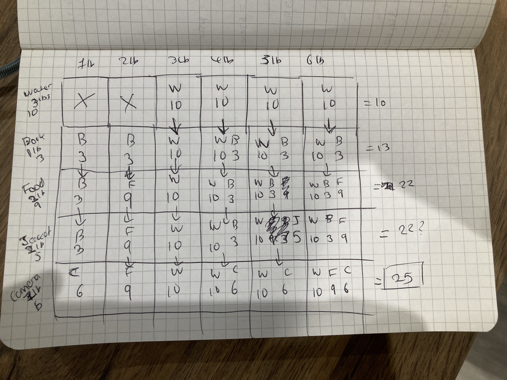

# Grokking Algorithms Exercises

[GitHub](https://github.com/egonSchiele/grokking_algorithms)
[Errata](https://www.adit.io/errata.html)

## Chapter 1 - Binary Search

### 1.1
Log₂ 128 = 7

### 1.2
Log₂ 256 = 8

### 1.3
O(log n)

### 1.4
O(n)

### 1.5
O(n)

### 1.6
O(n) - Explained in Chapter 4

## Chapter 2 - Selection Sort

### 2.1
Linked List

### 2.2
Linked List

### 2.3
Array

### 2.4
Need to keep allocating memory and re-sorting the entries. Inserting entries is slow.

### 2.5
**Hybrid Array + Linked List vs Array**:
- Inserting - Faster (random access array then unshift onto end of linked list)
- Searching - Slower (random access array, then search entire linked list)

**Hybrid Array + Linked List vs Linked List**:
- Inserting - Same (random access array then unshift onto end of linked list)
- Searching - Faster (only searching a partial linked list)

## Chapter 3 - Recursion and Call Stacks

### 3.1
A method called `greet` with a `name` parameter of `Maggie` was called.
This method called another method called `greet2` with the `name` parameter `Maggie` passed to it.
The `greet` method is waiting for `greet2` to complete before it can resume.

### 3.2
A recursive function with no base case would be stuck in an infinite loop.
It would continue to push calls onto the call stack until memory runs out, causing a stack overflow.

## Chapter 4 - Divide and Conquer (D&C) and Quicksort

### 4.1
`php ch4/02_recursise_sum.php`

### 4.2
`php ch4/03_recursise_count.php`

### 4.3
`php ch4/04_recursise_max.php`

### 4.4
**Base Case for Binary Search:**
The base case is an array containing 1 item.
If the item we're looking for matches the item in the array, we're done.

**Recursive Case for Binary Search:**
The recursive case is splitting the array in half, and throwing away the half we know doesn't contain a match.
Then we recursively perform another binary search on the remaining half.

### 4.5
O(n)

### 4.6
O(n)

### 4.7
O(1)

### 4.8
O(n²)

## Chapter 5 - Hash Tables

### 5.1
Consistent

### 5.2
Inconsistent

### 5.3
Inconsistent

### 5.4
Consistent (although only as an exercise, not reality)

### 5.5
Phone Book (Esther, Ben, Bob, Dan)
C. The hash function that uses the first letter of the string.
D. The hash function that maps every letter in the string to a prime number.

### 5.6
Batteries (A, AA, AAA, AAAA)
B. The hash function that returns the length of the string.
D. The hash function that maps every letter in the string to a prime number.

### 5.7
Books (Maus, Fun Home, Watchmen)
B. The hash function that returns the length of the string.
C. The hash function that uses the first letter of the string.
D. The hash function that maps every letter in the string to a prime number.

## Chapter 6 - Breadth First Search

### 6.1
2

### 6.2
2

### 6.3
A = invalid
B = valid
C = invalid

### 6.4
Wake Up, Pack Lunch, Exercise, Brush Teeth, Eat Breakfast, Shower, Get Dressed

### 6.4
A, C

## Chapter 7 - Trees

N/A

## Chapter 8 - Balanced Trees

N/A

## Chapter 9 - Dijkstra's Algorithm

### 9.1

8

### 9.2

60 - Because the directions of the cheapest paths go away from the finish.

### 9.3

4

## Chapter 10 - Greedy Algorithms

### 10.1

Keep picking the largest box that will fit in the furniture truck until there's no room left. This will not give the optimal solution.

### 10.2

Keep picking the travel itinerary activity with the highest point/time value until you've no time left. This will not give the optimal solution.

## Chapter 11 - Dynamic Programming

### 11.1

Yes. Because the Guitar 1lb $1500 + iPhone 1lb + $2000 + Keyboard 1lb $1500 = $4500, which is greater than the previous $4000 estimate.

## 11.2

Water 3lb 10, Food 2lb 9, Camera 1lb 6 = 25

