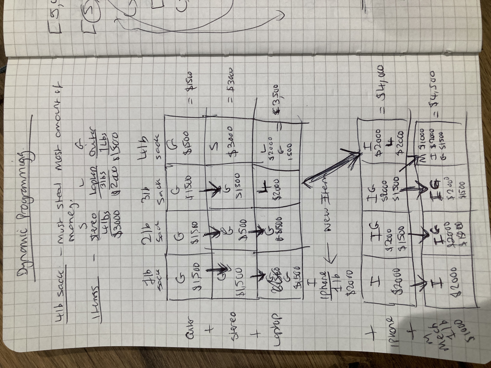

# Grokking Algorithms Notes

## Chapter 1 - Binary Search

**Binary Search**

An efficient way to find an item in a list.

It can find an item in a list containing 4 billion items in just 32 operations.

O(log n) = log time

It works like this:

- Sort the items in the list from lowest to highest.
- Check if the middle item in the list to the item you're searching for is higher or lower.
- Throw away the half it's not in.
- Repeat until you find the item.

Way more efficient than comparing every item in the list. Doing that on a list containing 4 billion items would take 4 billion operations.

O(n) = linear time

The travelling salesperson problem is where you try to find the most efficient route to visit 5 cities (as an example).

There's no known fast solution to this.

O(n!) = super slow time

Alogrithms aren't measured using speed, they're measured in the growth of the number of operations - called big O notation.

Big O notation established the **worst** case run time.


## Chapter 2 - Selection Sort

Think of memory as being a chest of draws. Each draw is a slot of available memory with a unique address.

**Arrays**

Arrays are inserted into memory sequentially (next to each other).

This means if you need to allocate extra memory if you want to expand the array later.

Arrays are quick to read, and can be read randomly and sequential.

It's slow to insert an item into an array, as you need to reorder the items in it. You also may need to allocate more memory if not enough is available.

Similarly, deletions are slow for the same reason as insertions.

Insertions can fail due to memory availability, but deletions can't.

- _Reading:_ O(1) = constant time
- _Insertion:_ O(n) = linear time
- _Deletion:_ O(n) = linear time

**Linked Lists**

A linked list consists of nodes that point to the address of the next node.

The advantage of this is that you can insert them in any random slot of memory available.

Linked lists are slow to read because you can only traverse them sequentially.

They also actually use more memory than arrays generally, as they need additional memory to hold the address of the next node.

It's quick to insert an item into a linked list than an array, especially if you want to insert something in the middle.

Similarly, deletions are quick for the same reason as insertions.

Insertions can fail due to memory availability, but deletions can't.

- _Reading:_ O(n) = linear time
- _Insertion:_ O(1) = constant time
- _Deletion:_ O(1) = constant time

It's common practice to keep track of the head and tail of an array or linked list.

**Selection Sort**

O(n x n) = O(n²) time

It works like this:

- Find the highest or lowest ranking item in the list.
- Move it to a new list.
- Repeat on the remaining items in list.

The number of items you have to search through decreases by one item each time, because you move the item out of the list.


## Chapter 3 - Recursion and Call Stacks

**Recursion**

Recursion functions call themselves to elegantly solve problems.

There are two parts to a recursive function:

The **base case** tells determines when the function does not call itself again (i.e. when to end).

The **recursive case** tells the function to call itself again.

I think of recursion as winding something up until it hits the innermost point before it begins to unwind again. Like that hadouken code meme.

**Call Stack**

A call stack is a data structure where new are items are pushed on to the top of the stack, and then popped off the top of the stack.

LIFO = Last In, First Out

You can imagine it as a stack of post-it notes.

Internally computers and programming languages uses call stacks.

Recursion elegantly uses the call stack, as each recursive call pushes another item onto the top of the call stack. Once it's done recursing, the call stack can be "unwound".


## Chapter 4 - Divide and Conquer (D&C) and Quicksort

**Divide and Conquer**

Divide and conquer is a recursive technique for problem solving. It works by breaking a problem down into smaller and smaller pieces.

It works like this:

- You figure out the **base case**, which is the simplest possible case.
- You divide or decrease your problem until it becomes the **base case**.

The base case is a list with 0 or 1 items. To sort a list with 0 or 1 items you do nothing.

**Quicksort**

Quicksort is a much faster sorting algorithm than selection sort.

It works like this:

- Identify a pivot point in the list.
- Move items that are smaller into a list on the left.
- Move items that are large into a list on the right.
- This is called **partitioning**.
- Repeat this process for the left and right lists.
- Join the left, pivot and right lists together.

The worst case scenario for quicksort is choosing the first item as a pivot for an already sorted list. This will incur a recursive call/call stack per item, as everything will always end up in the right hand list. O(n) items * O(n) call stacks = O(n²)

The best case scenario is choosing the middle item as a pivot, as the number of recursive calls/call stacks will be smaller. O(n) items * O(log n) call stacks = O(n log n)

The best case is also the average case. If you always choose a random element in the list as a pivot, quicksort will complete in O(n log n) on average. One exception is if all the items are the same, but this can be avoided with additional logic.

Quicksort is one of the fastest sorting algorithms, and a good example of divide and conquer.

Given two algorithms with the same big O notation running times, one can be consistently faster than the other. For example, quicksort is faster than mergesort.

Constants (C) don't matter in big O notation:

- Simple Search = 10ms per item (C) = 10ms * 4 billion items = 10ms * 4 billion operations = 463 days
- Binary Search = 1s per item (C) = 1s * 4 billion items = 1s * 32 operations = 32 seconds

The constants in these examples doesn't matter - binary search performs significantly less operations.


## Chapter 5 - Hash Tables

**Hash Functions**

A hash function is a function that given a string (e.g. `apple`) returns a number (e.g. `4`). The number returned will always be consistent for the string, so `apple` will always return `4`. Multiple strings can be mapped to numbers.

**Hash Tables**

A hash table is a combination of a hash function and an array. The number returned is the index of the value in the array that corresponds to the given string.

If the hash function is given `apple` and returns `4` with the following array, we know the price is `0.67`:

| 1    | 2    | 3    | 4    | 5    |
|------|------|------|------|------|
| 1.49 | 0.79 | 2.49 | 0.67 | 1.49 |

A hash table is O(1), because looking up an item in the array using a string is instant.

This type of one-to-one mapping is known as `injective function`.

A hash table is perfect when you want to:

- Map one thing to another (modelling relationships from one thing to another).
- Look something up instantly.
- Filter out duplicates.
- Caching or memoizing data to avoid work.

Some examples of using a hash table are:

- A phone book (`jenny => 8675309`, `emergency => 911`)
- A DNS look up cache (e.g. `google.com => xxx.xxx.xxx.xxx`)
- A webpage cache (e.g. `facebook.com/contact => <p>Contact...</p>`)

**Collisions**

A collision is when multiple strings passed to a hash function map to the same underlying array item. This could cause data to be overridden.

A solution is to have the array item point to a linked list, however this would mean the hash table no longer instant, as the linked list needs to be traversed.

Avoiding collisions is vital to getting average case performance out of a hash table.

The way to do this is by having a low load factor and a good hash function.

**Load Factor**

The load factor of a hash table is: `number of items / total number of array slots`.

A load factor of 1 or greater means there's enough slots free.

To make more room a new array is created, typically double the size of the original, and then the items are re-inserted into that. This is called resizing.

Typically, resizing is done when the load factor is greater than 0.7.

Resizing is expensive, but hash tables are still O(1) on average.

Hash functions aren't something you'd ever need to think about, but real world examples are MurmurHash and CityHash.

- [MurmurHash Wikipedia](https://en.wikipedia.org/wiki/MurmurHash)
- [PHP 8.1 MurmurHash](https://php.watch/versions/8.1/MurmurHash3)
- [MurmurHash in Rust](https://www.keiruaprod.fr/blog/2023/04/02/the-murmur-hashing-algorithm.html)
- [Bit Rotation](https://www.geeksforgeeks.org/rotate-bits-of-an-integer/)

O(1) = constant time = the time taken to perform the operation will stay the same regardless

Hash tables are really fast for search, insert and delete, and catching duplicates.


## Chapter 6 - Breadth First Search

**Graphs**

A graph is a data structure that models a set of connections, for example, routes to navigate from A to B, who owes who money or who is friends with whom.

A graph consistents of nodes and edges. An edge connects one node to another, and it may or may not have a direction.

The terminology for nodes on either side of an edge with a direction is "in-neighbour" or "out-neighbour".

So given: `A -> B` A is an in-neighbour of B. B is an out-neighbour of A.

If there is no edge direction (i.e. undirected) then the terminology is just "neighbour".

Traversing a graph can cause infinite loops because they can be cyclical, so it's necessary to keep track of what's been traversed to avoid this.

**Queues**

A queue is a data stucture that works like a real life queue. The person who joins the queue to get on a bus first will get on first, the person who joins the queue second will get on the bus second, etc.

Unlike call stacks, which are LIFO, queues are FIFO:

FIFO = First In, First Out

Adding an item to the end of a queue is known an "enqueueing", and removing an item from the start of a queue is known as "dequeueing". Items in the queue can only be accessed this way, and not by an index like an array.

**Breath First Search**

A breadth first search is an algorithm to search a graph. It can be used to find out:

1. Is there a path from A to B?
2. What's the shortest path from A to B?

It can be used for things such as spell checking (find closest actual word to the mispelt one), navigation (getting from point A to B) and crawling (like a search engine).

A breadth first search works by radiating out from starting point, so all the nodes 1 degree out are searched first, then all the nodes 2 degrees out are searched second etc.

In effect the breadth first search algorithm traverses or walks the tree.

This is achieved using a queue. All the nodes 1 degree out are added to the queue first, then as each of those nodes is dequeued/searched, _their_ nodes are added to the queue if a match isn't found - radiating outwards.

O(V + E) = O(Vertices + Edges)

A topological sort can be used to sort a directed graph in order of of dependencies. So given `A -> B -> C`, C must be done before B, and B must be done before A.

A tree is a special subset of graph where no edges ever point backwards. A tree is always a graph, but not all graphs are trees.


## Chapter 7 - Trees

**Trees**

A tree is a specialised type of graph that is used in everything from compressiom algorithms (Huffman coding) to databases (balanced-tree indexes).

In a tree the terminology for nodes is:

- Root - A single node that has no parent and leads to all the other nodes (aka a "rooted tree").
- Parent - A node that has child nodes belong to it.
- Child - A node that belongs to a parent.
- Leaf - A node with no children.

A tree is a "connected, acyclical graph".

Traversing a tree can never end up in an infinite loop because they don't have cycles and only go in one direction.

**Depth First Search**

Depth first search essentially uses recursion to traverse each node's children until it hits a leaf. An example of how it could be used is to print out all the files in a filesystem tree. It **cannot** be used to find the shortest path from A to B like breadth first search can.

**Binary Trees**

A binary tree is a special type of tree where nodes can have a maximum of two children (hence binary, `1` or `0`), which are traditionally known as the left and right child.

Subtrees in a binary tree may also be referred to as the left and right subtrees.

Binary trees are exremetely common in computer science, and are used for things such as compression (Huffman coding) and database indexes (b-trees).


## Chapter 8 - Balanced Trees

**Balanced Trees**

A balanced binary search tree (BST) is a special type of tree. Each now has up to two children, known as the left and right child nodes. The left child is always smaller than it's parent, and the right child node is always larger. An effect of this is the root node's left children alway smaller, and its right children are always larger.

To search a binary tree for a value we start at the root node, and then go left if the value is smaller, or right if its larger. We repeat this until either the value is found or we hit a leaf node, indicating there's no match.

Binary trees are worst case O(n), best case O(log n). For example, worst case could be 7 nodes each a parent of another (essentially a linked list), the best case would be 7 nodes balanced across 2 depths (aka height of 2). Balancing a tree is the key to maintaining the optimal height for good performance.

A balanced tree is O(log n) for search and insertion, making it faster than sorted arrays and linked lists.

The height of a tree affects its performance.

**AVL Balanced Tree**

An AVL balanced tree is a form of self balancing tree that uses node rotation to re-balance nodes, which ensures optimal height and O(log n) performance.

A height (e.g. 2) or balance factor can be stored (e.g. -1 left, 1 right) to determine when to rotate the nodes. The balance factor is the height of the left subtree minus the height of the right subtree. For example, if the balance factor difference is greater than one (e.g. -2 or 2) then the tree needs re-balancing.

- [AVL Tree Wikipedia](https://en.wikipedia.org/wiki/AVL_tree)
- [AVL Tree JavaPoint](https://www.javatpoint.com/avl-tree)
- [AVL Tree Balancing](https://justinmchase.com/tag/avl-tree/)
- [AVL Balance Factor](https://www.youtube.com/watch?v=zh27Tp8HV7E)

**Splay Trees**

A splay tree is a form of tree that rotates the most recent search match node to the root, meaning it can be looked up again faster.

The trade off is that rotating the matching node to the root takes time, so searches could take linear time O(n). However O(n log n) is guaranteed on average, making a good choice for some scenarios.

**B-Trees**

A b-tree is a generalised form of binary tree, often used in database indexing. Nodes can have more than two children.

Each node child node generally contains multiple keys (e.g. 3 and 6). Its left child nodes are lower (e.g. 1 and 2), centre child nodes are within (4 and 5), and right child nodes are higher (e.g. 7 and 8).

Because a b-tree has more keys per node, it avoids seek time at the expense of reading time. We read more data in one go, which makes it fast.


## Chapter 9 - Dijkstra's Algorithm

A weighted graph is a one where the edges have been assigned a cost.

Dijkstra's Algorithm can be used to calculate the shortest path along a directed and weighted graph. However, Dijkstra's Algorithm doesn't work with negative weights, the Bellman-Ford algorithm is needed for that.  In contrast, a breadth first search from the previous chapter can be used to find the short path for an unweighted graph.

The steps for the algorithm are:

- Find the cheapest cost node.
- Check whether there's a cheaper path to the node's out-neighbours, if so, update their costs.
- Repeat until you've processed every node in the graph.
- Calculate the final, shortest path.


## Chapter 10 - Greedy Algorithms

The greedy algorithm is a very simple problem-solving strategy. A benefit is they are also simple to come up with.

The steps for the algorithm involve picking the next locally optimal move. Repeating this eventually leads to the global optimal solution. Sometimes the algorithm doesn't work, however perfect is the enemy of good, and it can solve many problems pretty well.

**Classroom Scheduling Problem**

For example, if you had to schedule a school classroom for use, and you had lessons with start and end times that overlap, the solution would be:

- Pick the class that ends soonest. This class goes first.
- Pick the next class that starts after this class ends, and has ends soonest. This class goes next.
- Repeat until the schedule is full.

**Knapsack Problem**

Another example is the knapsack problem. If you have a backpack than can hold a fixed weight of items, and each item has a resale value, the greedy algorithm solution would be:

- Pick the most expensive item under the remaining knapsack weight limit.
- Pick the next most expensive item under the remaining knapsack weight limit.

The algorithm will not necessarily solve this problem, as two low weight items might be more valuable than a higher weight one.

**Set Covering Problem**

Imagine you have radio stations that cover different US states, and you wanted to find the smallest set of stations to cover each 50 states. This would be extremely difficult to figure out. You'd have to list every possible subset of stations (the power set). It would take O(2n) time, where `n` is the number of radio stations, because there are `2n` subsets to work through.

The greedy algorithm can provide an approximation very quickly:

- Pick the station that covers the most states that haven't been covered yet. It's fine if some states have been covered before.
- Repeat until all the states are covered.

This will quickly and simply produce a close to optimal solution in O(n2) time.

Approximation algorithms are judged by how fast they are, and how close to the optimal solution their results are.

Set covering is known as an NP-hard problem.


## Chapter 11 - Dynamic Programming

Dynamic programming is a technique to solve hard problems by breaking them down into smaller sub-problems, and solving those first.

This involves building a grid of rows and columns to sub-divide the problem:



The image above shows the solution to the knapsack problem using dynamic programming. New items are added twice (an iPhone and a Mechanical Keyboard).

- The order of the items in the grid doesn't matter.
- The value of the cells can never go down or decrease.
- Which thing goes across which axis may or may not matter depending on the problem.
- You can add granularity (e.g. instead of 1lb sacks, do 0.5lb increment sacks).
- You can't use fractions, a greedy algorithm would work better for this.
- You can't solve problems unless they're discrete, if problems depend on further sub problems is won't work.

The actual math involved in each the problem for each cell is:

```
// i = row
// j = column

cell[i][j] = max of (
    // the previous max
    cell[i - 1][j]

    // value of the current item + value of remaining space
    cell[i - 1][j - value]
)
```

An example of dynamic programming is the Levenshtein Distance algorithm to determine how close two strings are, which is used for detecting spelling mistakes.

- [Levenshtein Distance Wikipedia](https://en.wikipedia.org/wiki/Levenshtein_distance)
- [Measuring Text Similarity Using the Levenshtein Distance](https://blog.paperspace.com/measuring-text-similarity-using-levenshtein-distance/)

You can also use dynamic programming to solve the minimum coins problem:

- [GitHub Gist](https://gist.github.com/ziadoz/d7b82881a365819d593493aa69213ab9)
- [Min Coins Recursion](https://www.youtube.com/watch?v=Rl8P9SJptQM)
- [The Change Making Problem](https://www.youtube.com/watch?v=jgiZlGzXMBw)


## Chapter 12 - K-Nearest Neighbours

The K-Nearest Neighbours (KNN) algorithm allows you build a classification system.

It starts with feature extraction. For example if you were attempting to classify oranges and grapefruits, the features could be "size" and "redness". You can then plot these on a X/Y axis graph.

With the features plotted on an X/Y graph, you can then use the Pythagorean formula `√ (x - x₂)² + (y - y₂)²` to determine the distance between them. This could be used to build a recommendation algorithm (e.g. similar movie preferences).

You can also produce regressions, which is predicting a response (e.g. how many loaves a bakery should cook based on previous week/weekdays, sports events, weather, loaves sold). This involves finding the nearest neighbours, and then determining the average value.

`k` refers to the number of nearest neighbours (e.g. `k = 4` means we want the four nearest neighbours).

- **Feature Extraction**: Identify the features of the things you want to classify.
- **Classification**: Classifying things in different groups or taxonomies.
- **Regression**: Predicting a response.

**Bakery Regression Example:**

vector = `(weather 1 - 5, weekend/holiday 1 | 0, sports event 1 | 0) = loaves sold`

- A: `(5, 1, 0) = 300 loaves`
- B: `(3, 1, 1) = 225 loaves`
- C: `(1, 1, 0) = 75 loaves`
- D: `(4, 0, 1) = 200 loaves`
- E: `(4, 0, 0) = 150 loaves`
- F: `(2, 0, 0) = 350 loaves`

Predicate number of loaves needed to bake for `(4, 1, 0)` with `k = 4`:

- A: `(4 - 5)^2 + (1 - 1)^2 + (0 - 0)^2 = 1`
- B: `(4 - 3)^2 + (1 - 1)^2 + (0 - 1)^2 = 2`
- C: `(4 - 1)^2 + (1 - 1)^2 + (0 - 0)^2 = 9`
- D: `(4 - 4)^2 + (1 - 0)^2 + (0 - 1)^2 = 2`
- E: `(4 - 4)^2 + (1 - 0)^2 + (0 - 0)^2 = 1`
- F: `(4 - 2)^2 + (1 - 0)^2 + (0 - 0)^2 = 5`

So `k = 4` are A, B, D and E: `(300 + 225 + 200 + 150) / 4 = 218.75` loaves should be baked!

**Cosine Similarity** is an alternative to using the distance formula, as it compares the angle between two vectors, rather than distance. As example, this could better account for two users who might have similar tastes, but where one rates things movies more conservatively than the other.

Picking features to extract is vital, as incorrect or biased features might give poor results. For example, asking someone to only rate comedy files wouldn't tell you anything about what they think of horror films.

If you have `n` classified things, you should look at `sqrt(n)` neighbours as a good rule of thumb.

KNN is used in machine learning, some examples are:

- Optical Character Recognition (OCR): Identify and measure curves, lines and points of existing numbers.
- Spam filtering: Naive Bates Classifier. Probability words will show up in a spam email.
- Stock market predictions: Very difficult to extract useful features, or predict the future. Too many variables.

The high level steps for machine learning are:

- Gathering Data (e.g. asking users for film ratings)
- Cleaning Data (e.g. removing users who randomly rank films for fun)
- Extracting Features
- Training (use KNN or SVM, train with 90% of the data)
- Evaluation (get model to produce predictions and compare to 10% of data held back)
- Parameter Tuning (adjust `k = ?` or other algorithm parameters and re-evaluate predictions)


## Chapter 13 - Where To Go Next

**Linear Regression:**

Plot a bunch of points on an X/Y axis, and then draw a line that roughly tracks through all the points. This line can then be used to make predictions.

**Inverted Indexes:**

A hash table that relates two pieces of information (e.g. words and the webpages they appear on). Commonly used in search engine indexing.

**Fourier Transform:**

A rare, brilliant and elegant algorithm with a million use cases.

- Given a smoothie could tell you the ingredients.
- Given a song it could tell you all the individual frequencies.

It's great for processing signals:

- Used to boost bass and hide treble in music.
- Used to compress music (MP3) by working out frequencies that contribute less to the song.
- Used to compress JPEGs.
- Used to predict earthquakes.
- Used to analyse DNA.

**Parallel Algorithms:**

Algorithms are hard to make faster. Distributing them over multiple CPU cores can increase performance. However, it's difficult to do, and the gains aren't linear.

Some complexities include:

- The overhead of managing the parallelism (e.g. splitting and then re-merging arrays)..
- Amdahl's Law says the performance gain of optimising a part of a system is limited by how much time overall that part actually takes (e.g. if it's only 1% of the overall time taken, the gains will be small).
- Deciding how to load balance what you want to parallelise (e.g. one core doing all the easy tasks, and the other doing all the hard ones would be inefficient).

**Map/Reduce:**

A special type of parallel algorithm called a distributed algorithm, popularised by Google.

Distribute the workload over multiple machines or cores to speed things up.

**Bloom Filters and HyperLogLog:**

Imagine you have a huge set of data, for example URLs of stories added to Reddit.

Identifying if the story had been posted before could be done with a hash table, but it would use too much memory.

A bloom filter is a probabilistic data structure. It can tell you if the story has been posted before, but it may return a false positive. It will never return a false negative though (i.e. if a story hasn't been posted before). Bloom filters take up very little space.

HyperLogLog approximates the number of unique elements in a data set. It can't give an exact answer, but the benefit is it uses a fraction of the memory typically required to do this.

**HTTPs and Diffie Hellman Key Exchange:**

An algorithm used in HTTPS to generate private and public keys a server can exchange.

The client and server each generate a private key, and a common pattern, which is overlayed on their private key to produce public keys which can be exchanged and used to decrypt each others messages.

TLS uses Ephemeral Diffie Hellman, which means the private keys are discarded per connection, so exposure it limited if leaked.

**Locality-Sensitive Hashing:**

Hashing two similar strings would typically produce two entirely different hashes. However, it's also useful to be able produce similar hashes depending on how much has changed.

This can be done using Simhash, which Google use to detect duplicates when crawling webpages, detecting plagiarised or similar student essays, or detecting copyrighted content.

**Min Heaps and Priority Queues:**

A min heap is a tree structure that holds numbers, with the lowest being at the root. This means you can find the smallest number in O(1) time. You can also pop off the smallest number root node to get to the next smallest number in O(log n) time. A max heap is basically the reverse.

You can use these to sort numbers quickly by putting them in a min heap and then repeatedly popping off the root node, which contains the smallest number.

Heaps are great for implementing priority queues. Create a max heap of priorities and then pop off the root node max value.

**Linear Programming:**

An advanced algorithm used to maximise something when given linear constraints. For example, if you need a specific amount of material and buttons to make totes and t-shirts, but t-shirts sell for more, it could tell you how to maximise the materials you currently had available for profit.
